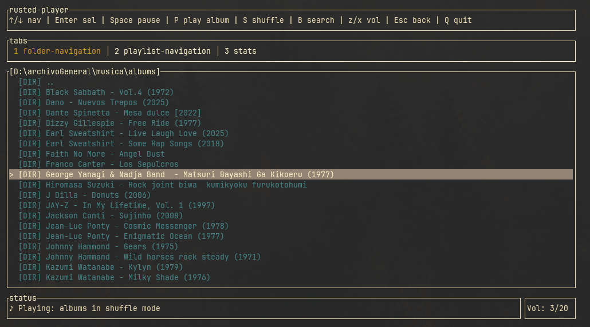
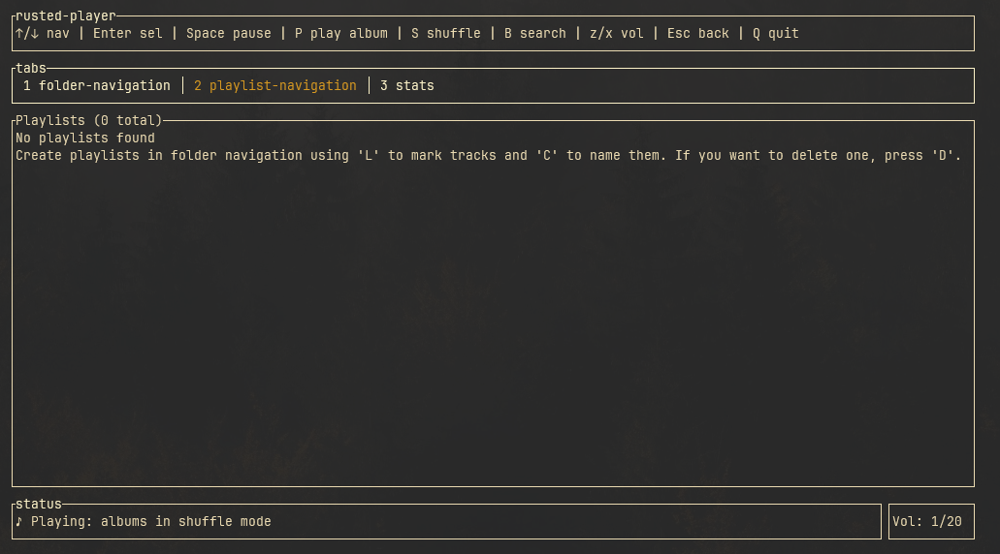
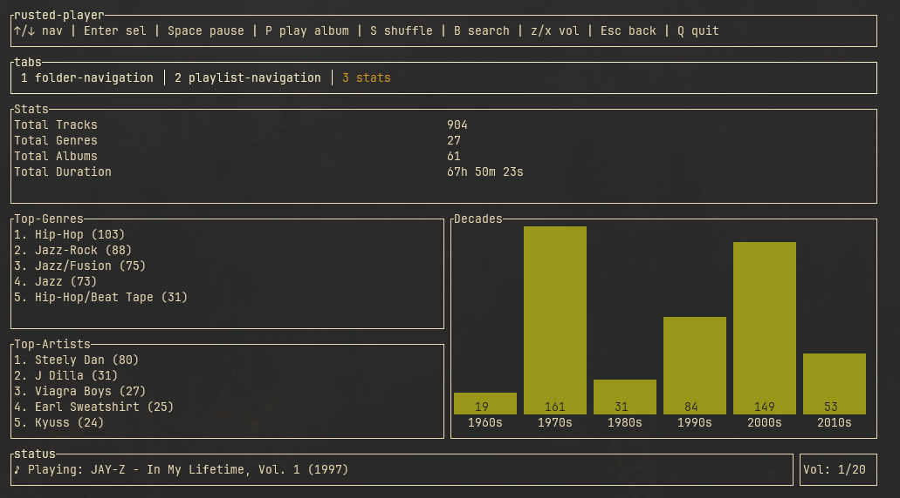
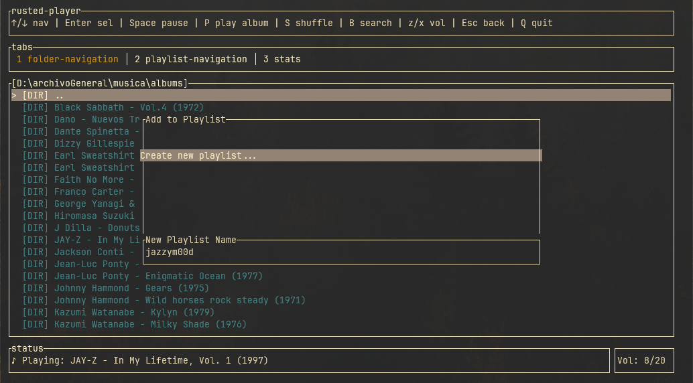

## rusted-player

Un pseudo-reproductor de música ligero, sencillo y enfocado en la navegación de carpetas con una interfaz de usuario de terminal, escrito en Rust. 

Producto de mi acercamiento a Rust. Se podría decir que es un intento de reescritura de un proyecto anterior en .NET con C# (https://github.com/999monk/mpv-tui-sharp). La diferencia es que en este no usé mpv como reproductor externo sino que una librería de audio. Luego también sumé un servicio de extracción de metedata que me permitió agregar funcionalidades y detalles nuevos.

### Mejoras y cambios recientes

Esta versión incluye mejoras significativas en robustez, rendimiento y compatibilidad:

*   **Soporte multiplataforma:** Ahora funciona en Linux, macOS y Windows, detectando automáticamente el directorio de configuración apropiado para cada sistema.
*   **Mayor robustez:** Eliminados todos los `unwrap()` que podían causar panics. Manejo de errores graceful para archivos con metadata corrupta.
*   **Mejoras de rendimiento:** Cambio de `Vec` a `HashSet` para búsquedas O(1). Optimización en la deduplicación de géneros.
*   **Seguridad:** Validación de nombres de playlist para prevenir path traversal.
*   **Tipado correcto:** Cambio de `String` a `PathBuf` para rutas de archivos según las mejores prácticas de Rust.
*   **Sin superposición de audio:** Corregido bug donde las canciones se superponían al cambiar de reproducción.

### Tecnologías y librerías principales

*   **UI** → Ratatui.
*   **Audio** → Rodio.
*   **Metadata** → Lofty.

### Características

*   **Navegación de carpetas:** Navega por tu biblioteca de música usando el teclado.
*   **Gestión de playlist:** Crea, elimina y añade pistas a playlists.
*   **Reproducción de música:** Reproduce, pausa, salta y controla el volumen de la música.
*   **Modo aleatorio:** Reproduce tu música en modo aleatorio.
*   **Búsqueda:** Busca algo específico.
*   **Pestaña de estadísticas:** Consulta las estadísticas de tu biblioteca de música, que incluyen:
    *   Total de pistas, géneros, artistas y álbumes.
    *   Duración total de la biblioteca de música.
    *   "Tops" en forma de listas.
    *   Un gráfico de "Décadas".
*   **Configuración:** Configura tu directorio principal de música.

### Uso

1. Descargar el ejectucable.
2. Agregarlo al PATH.
3. Ejecutarlo desde tu consola preferida. La primera vez es necesario configurar el directorio principal pasándolo como argumento:
   `rusted-player.exe "D:\TuRuta\"`
3. Ejecutarlo desde tu consola preferida. La primera vez es necesario configurar el directorio principal pasandolo como argumento:
   `rusted-player.exe "\TuRuta\"

### Binds

| Tecla     | Acción                                                  |
|-----------|---------------------------------------------------------|
| `↑`/`↓`   | Navegar                                                 |
| `Enter`   | Seleccionar                                             |
| `Espacio` | Pausar                                                  |
| `P`       | Reproducir álbum                                        |
| `S`       | Aleatorio                                               |
| `z`/`x`   | Control de volumen                                      |
| `Esc`     | Atrás                                                   |
| `Q`       | Salir                                                   |
| `1`       | Ir a la pestaña de Navegación de carpetas               |
| `2`       | Ir a la pestaña de Navegación de listas de reproducción |
| `3`       | Ir a la pestaña de Estadísticas                         |
| `l`       | Marcar pista para la lista de reproducción              |
| `c`       | Crear lista de reproducción                             |
| `d`       | Eliminar lista de reproducción                          |
| `b`       | Realizar una búsqueda                                   |

### Preview

|                                       |                                       |
|:-------------------------------------:|:-------------------------------------:|
|  |               |
|                                       |                                       |
|  |  |
